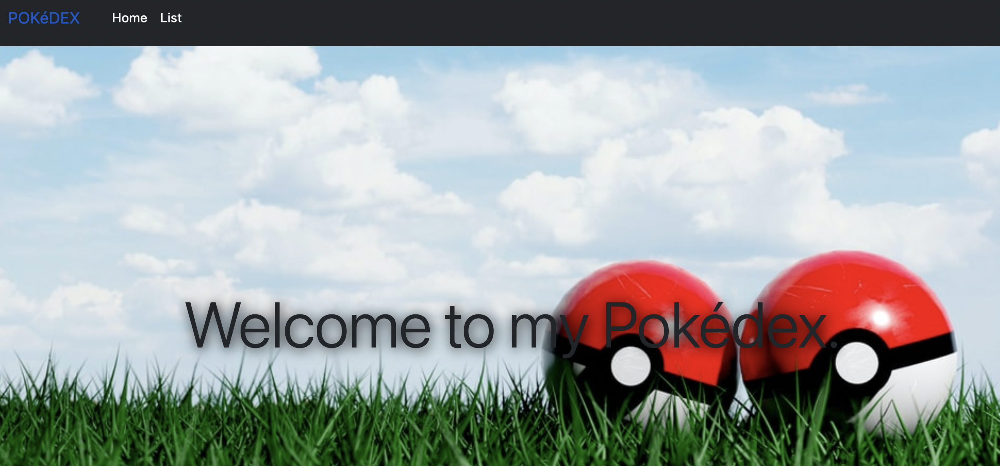

# Pokédex

An app for learning hooks and component libaries.

The app is a library of pokemons. Find your favourite!

## Technologies used

Built with:

- HTML
- JS
- Reactjs
- PokeAPI: https://pokeapi.co/

## Setup and usage

### `npm start`

Runs the app in the development mode.\
Open [http://localhost:3000](http://localhost:3000) to view it in the browser.

## Screenshots

 "Main View"

 "Solution view"

## Sources

- Business College Helsinki. React lessons.

## Authors and acknowledgment

Abel Parada

- [GitHub @abel-parada](https://github.com/abel-parada)
- [LinkedIn](https://www.linkedin.com/in/abelparadamillan/)
